```mermaid
flowchart TB
    subgraph current["docs.shproj"]
        MAIN["<b>📦&nbsp;docs.shproj</b><br/><small>net8.0;net10.0</small>"]
        click MAIN "#docsdocsshproj"
    end

```

```mermaid
flowchart TB
    subgraph upstream["Dependants (1)"]
        P3["<b>📦&nbsp;Hyperbee.Expressions.Tests.csproj</b><br/><small>net8.0;net9.0</small>"]
        click P3 "#testhyperbeeexpressionstestshyperbeeexpressionstestscsproj"
    end
    subgraph current["Hyperbee.Expressions.Lab.csproj"]
        MAIN["<b>📦&nbsp;Hyperbee.Expressions.Lab.csproj</b><br/><small>net8.0;net9.0</small>"]
        click MAIN "#srchyperbeeexpressionslabhyperbeeexpressionslabcsproj"
    end
    subgraph downstream["Dependencies (1"]
        P4["<b>📦&nbsp;Hyperbee.Expressions.csproj</b><br/><small>net8.0;net9.0</small>"]
        click P4 "#srchyperbeeexpressionshyperbeeexpressionscsproj"
    end
    P3 --> MAIN
    MAIN --> P4

```

```mermaid
flowchart TB
    subgraph upstream["Dependants (3)"]
        P2["<b>📦&nbsp;Hyperbee.Expressions.Benchmark.csproj</b><br/><small>net9.0</small>"]
        P3["<b>📦&nbsp;Hyperbee.Expressions.Tests.csproj</b><br/><small>net8.0;net9.0</small>"]
        P5["<b>📦&nbsp;Hyperbee.Expressions.Lab.csproj</b><br/><small>net8.0;net9.0</small>"]
        click P2 "#testhyperbeeexpressionsbenchmarkhyperbeeexpressionsbenchmarkcsproj"
        click P3 "#testhyperbeeexpressionstestshyperbeeexpressionstestscsproj"
        click P5 "#srchyperbeeexpressionslabhyperbeeexpressionslabcsproj"
    end
    subgraph current["Hyperbee.Expressions.csproj"]
        MAIN["<b>📦&nbsp;Hyperbee.Expressions.csproj</b><br/><small>net8.0;net9.0</small>"]
        click MAIN "#srchyperbeeexpressionshyperbeeexpressionscsproj"
    end
    P2 --> MAIN
    P3 --> MAIN
    P5 --> MAIN

```

```mermaid
flowchart TB
    subgraph current["Hyperbee.Expressions.Benchmark.csproj"]
        MAIN["<b>📦&nbsp;Hyperbee.Expressions.Benchmark.csproj</b><br/><small>net9.0</small>"]
        click MAIN "#testhyperbeeexpressionsbenchmarkhyperbeeexpressionsbenchmarkcsproj"
    end
    subgraph downstream["Dependencies (1"]
        P4["<b>📦&nbsp;Hyperbee.Expressions.csproj</b><br/><small>net8.0;net9.0</small>"]
        click P4 "#srchyperbeeexpressionshyperbeeexpressionscsproj"
    end
    MAIN --> P4

```

```mermaid
flowchart TB
    subgraph current["Hyperbee.Expressions.Tests.csproj"]
        MAIN["<b>📦&nbsp;Hyperbee.Expressions.Tests.csproj</b><br/><small>net8.0;net9.0</small>"]
        click MAIN "#testhyperbeeexpressionstestshyperbeeexpressionstestscsproj"
    end
    subgraph downstream["Dependencies (2"]
        P4["<b>📦&nbsp;Hyperbee.Expressions.csproj</b><br/><small>net8.0;net9.0</small>"]
        P5["<b>📦&nbsp;Hyperbee.Expressions.Lab.csproj</b><br/><small>net8.0;net9.0</small>"]
        click P4 "#srchyperbeeexpressionshyperbeeexpressionscsproj"
        click P5 "#srchyperbeeexpressionslabhyperbeeexpressionslabcsproj"
    end
    MAIN --> P4
    MAIN --> P5

```

# Projects and dependencies analysis

This document provides a comprehensive overview of the projects and their dependencies in the context of upgrading to .NETCoreApp,Version=v8.0.

## Table of Contents

- [Executive Summary](#executive-Summary)
  - [Highlevel Metrics](#highlevel-metrics)
  - [Projects Compatibility](#projects-compatibility)
  - [Package Compatibility](#package-compatibility)
  - [API Compatibility](#api-compatibility)
- [Aggregate NuGet packages details](#aggregate-nuget-packages-details)
- [Top API Migration Challenges](#top-api-migration-challenges)
  - [Technologies and Features](#technologies-and-features)
  - [Most Frequent API Issues](#most-frequent-api-issues)
- [Projects Relationship Graph](#projects-relationship-graph)
- [Project Details](#project-details)

  - [docs\docs.shproj](#docsdocsshproj)
  - [src\Hyperbee.Expressions.Lab\Hyperbee.Expressions.Lab.csproj](#srchyperbeeexpressionslabhyperbeeexpressionslabcsproj)
  - [src\Hyperbee.Expressions\Hyperbee.Expressions.csproj](#srchyperbeeexpressionshyperbeeexpressionscsproj)
  - [test\Hyperbee.Expressions.Benchmark\Hyperbee.Expressions.Benchmark.csproj](#testhyperbeeexpressionsbenchmarkhyperbeeexpressionsbenchmarkcsproj)
  - [test\Hyperbee.Expressions.Tests\Hyperbee.Expressions.Tests.csproj](#testhyperbeeexpressionstestshyperbeeexpressionstestscsproj)

## Executive Summary

### Highlevel Metrics

| Metric | Count | Status |
| :--- | :---: | :--- |
| Total Projects | 5 | 0 require upgrade |
| Total NuGet Packages | 17 | All compatible |
| Total Code Files | 84 |  |
| Total Code Files with Incidents | 0 |  |
| Total Lines of Code | 12905 |  |
| Total Number of Issues | 0 |  |
| Estimated LOC to modify | 0+ | at least 0.0% of codebase |

### Projects Compatibility

| Project | Target Framework | Difficulty | Package Issues | API Issues | Est. LOC Impact | Description |
| :--- | :---: | :---: | :---: | :---: | :---: | :--- |
| [docs\docs.shproj](#docsdocsshproj) | net8.0;net10.0 | ✅ None | 0 | 0 |  | DotNetCoreApp, Sdk Style = True |
| [src\Hyperbee.Expressions.Lab\Hyperbee.Expressions.Lab.csproj](#srchyperbeeexpressionslabhyperbeeexpressionslabcsproj) | net8.0;net9.0 | ✅ None | 0 | 0 |  | ClassLibrary, Sdk Style = True |
| [src\Hyperbee.Expressions\Hyperbee.Expressions.csproj](#srchyperbeeexpressionshyperbeeexpressionscsproj) | net8.0;net9.0 | ✅ None | 0 | 0 |  | ClassLibrary, Sdk Style = True |
| [test\Hyperbee.Expressions.Benchmark\Hyperbee.Expressions.Benchmark.csproj](#testhyperbeeexpressionsbenchmarkhyperbeeexpressionsbenchmarkcsproj) | net9.0 | ✅ None | 0 | 0 |  | DotNetCoreApp, Sdk Style = True |
| [test\Hyperbee.Expressions.Tests\Hyperbee.Expressions.Tests.csproj](#testhyperbeeexpressionstestshyperbeeexpressionstestscsproj) | net8.0;net9.0 | ✅ None | 0 | 0 |  | ClassLibrary, Sdk Style = True |

### Package Compatibility

| Status | Count | Percentage |
| :--- | :---: | :---: |
| ✅ Compatible | 17 | 100.0% |
| ⚠️ Incompatible | 0 | 0.0% |
| 🔄 Upgrade Recommended | 0 | 0.0% |
| ***Total NuGet Packages*** | ***17*** | ***100%*** |

### API Compatibility

| Category | Count | Impact |
| :--- | :---: | :--- |
| 🔴 Binary Incompatible | 0 | High - Require code changes |
| 🟡 Source Incompatible | 0 | Medium - Needs re-compilation and potential conflicting API error fixing |
| 🔵 Behavioral change | 0 | Low - Behavioral changes that may require testing at runtime |
| ✅ Compatible | 0 |  |
| ***Total APIs Analyzed*** | ***0*** |  |

## Aggregate NuGet packages details

| Package | Current Version | Suggested Version | Projects | Description |
| :--- | :---: | :---: | :--- | :--- |
| BenchmarkDotNet | 0.15.2 |  | [Hyperbee.Expressions.Benchmark.csproj](#testhyperbeeexpressionsbenchmarkhyperbeeexpressionsbenchmarkcsproj) | ✅Compatible |
| coverlet.collector | 6.0.4 |  | [Hyperbee.Expressions.Tests.csproj](#testhyperbeeexpressionstestshyperbeeexpressionstestscsproj) | ✅Compatible |
| DotNext.Metaprogramming | 5.23.0 |  | [Hyperbee.Expressions.Benchmark.csproj](#testhyperbeeexpressionsbenchmarkhyperbeeexpressionsbenchmarkcsproj) | ✅Compatible |
| FastExpressionCompiler | 5.1.1 |  | [Hyperbee.Expressions.Benchmark.csproj](#testhyperbeeexpressionsbenchmarkhyperbeeexpressionsbenchmarkcsproj) [Hyperbee.Expressions.Tests.csproj](#testhyperbeeexpressionstestshyperbeeexpressionstestscsproj) | ✅Compatible |
| Hyperbee.Collections | 2.4.0 |  | [Hyperbee.Expressions.csproj](#srchyperbeeexpressionshyperbeeexpressionscsproj) [Hyperbee.Expressions.Lab.csproj](#srchyperbeeexpressionslabhyperbeeexpressionslabcsproj) | ✅Compatible |
| Hyperbee.Json | 3.0.6 |  | [Hyperbee.Expressions.Lab.csproj](#srchyperbeeexpressionslabhyperbeeexpressionslabcsproj) [Hyperbee.Expressions.Tests.csproj](#testhyperbeeexpressionstestshyperbeeexpressionstestscsproj) | ✅Compatible |
| Microsoft.CodeAnalysis.CSharp | 4.14.0 |  | [Hyperbee.Expressions.csproj](#srchyperbeeexpressionshyperbeeexpressionscsproj) [Hyperbee.Expressions.Lab.csproj](#srchyperbeeexpressionslabhyperbeeexpressionslabcsproj) | ✅Compatible |
| Microsoft.Extensions.Configuration | 9.0.8 |  | [Hyperbee.Expressions.csproj](#srchyperbeeexpressionshyperbeeexpressionscsproj) [Hyperbee.Expressions.Lab.csproj](#srchyperbeeexpressionslabhyperbeeexpressionslabcsproj) [Hyperbee.Expressions.Tests.csproj](#testhyperbeeexpressionstestshyperbeeexpressionstestscsproj) | ✅Compatible |
| Microsoft.Extensions.Configuration.Binder | 9.0.8 |  | [Hyperbee.Expressions.csproj](#srchyperbeeexpressionshyperbeeexpressionscsproj) [Hyperbee.Expressions.Lab.csproj](#srchyperbeeexpressionslabhyperbeeexpressionslabcsproj) | ✅Compatible |
| Microsoft.Extensions.DependencyInjection | 9.0.8 |  | [Hyperbee.Expressions.csproj](#srchyperbeeexpressionshyperbeeexpressionscsproj) [Hyperbee.Expressions.Lab.csproj](#srchyperbeeexpressionslabhyperbeeexpressionslabcsproj) [Hyperbee.Expressions.Tests.csproj](#testhyperbeeexpressionstestshyperbeeexpressionstestscsproj) | ✅Compatible |
| Microsoft.Extensions.Hosting | 9.0.8 |  | [Hyperbee.Expressions.Tests.csproj](#testhyperbeeexpressionstestshyperbeeexpressionstestscsproj) | ✅Compatible |
| Microsoft.Extensions.Http | 9.0.8 |  | [Hyperbee.Expressions.Lab.csproj](#srchyperbeeexpressionslabhyperbeeexpressionslabcsproj) [Hyperbee.Expressions.Tests.csproj](#testhyperbeeexpressionstestshyperbeeexpressionstestscsproj) | ✅Compatible |
| Microsoft.NET.Test.Sdk | 17.14.1 |  | [Hyperbee.Expressions.Tests.csproj](#testhyperbeeexpressionstestshyperbeeexpressionstestscsproj) | ✅Compatible |
| Microsoft.SourceLink.GitHub | 8.0.0 |  | [docs.shproj](#docsdocsshproj) [Hyperbee.Expressions.Benchmark.csproj](#testhyperbeeexpressionsbenchmarkhyperbeeexpressionsbenchmarkcsproj) [Hyperbee.Expressions.csproj](#srchyperbeeexpressionshyperbeeexpressionscsproj) [Hyperbee.Expressions.Lab.csproj](#srchyperbeeexpressionslabhyperbeeexpressionslabcsproj) [Hyperbee.Expressions.Tests.csproj](#testhyperbeeexpressionstestshyperbeeexpressionstestscsproj) | ✅Compatible |
| MSTest.TestAdapter | 3.10.2 |  | [Hyperbee.Expressions.Tests.csproj](#testhyperbeeexpressionstestshyperbeeexpressionstestscsproj) | ✅Compatible |
| MSTest.TestFramework | 3.10.2 |  | [Hyperbee.Expressions.Tests.csproj](#testhyperbeeexpressionstestshyperbeeexpressionstestscsproj) | ✅Compatible |
| Nerdbank.GitVersioning | 3.8.38-alpha |  | [docs.shproj](#docsdocsshproj) [Hyperbee.Expressions.Benchmark.csproj](#testhyperbeeexpressionsbenchmarkhyperbeeexpressionsbenchmarkcsproj) [Hyperbee.Expressions.csproj](#srchyperbeeexpressionshyperbeeexpressionscsproj) [Hyperbee.Expressions.Lab.csproj](#srchyperbeeexpressionslabhyperbeeexpressionslabcsproj) [Hyperbee.Expressions.Tests.csproj](#testhyperbeeexpressionstestshyperbeeexpressionstestscsproj) | ✅Compatible |

## Top API Migration Challenges

### Technologies and Features

| Technology | Issues | Percentage | Migration Path |
| :--- | :---: | :---: | :--- |

### Most Frequent API Issues

| API | Count | Percentage | Category |
| :--- | :---: | :---: | :--- |

## Projects Relationship Graph

Legend:
📦 SDK-style project
⚙️ Classic project

```mermaid
flowchart LR
    P1["<b>📦&nbsp;docs.shproj</b><br/><small>net8.0;net10.0</small>"]
    P2["<b>📦&nbsp;Hyperbee.Expressions.Benchmark.csproj</b><br/><small>net9.0</small>"]
    P3["<b>📦&nbsp;Hyperbee.Expressions.Tests.csproj</b><br/><small>net8.0;net9.0</small>"]
    P4["<b>📦&nbsp;Hyperbee.Expressions.csproj</b><br/><small>net8.0;net9.0</small>"]
    P5["<b>📦&nbsp;Hyperbee.Expressions.Lab.csproj</b><br/><small>net8.0;net9.0</small>"]
    P2 --> P4
    P3 --> P4
    P3 --> P5
    P5 --> P4
    click P1 "#docsdocsshproj"
    click P2 "#testhyperbeeexpressionsbenchmarkhyperbeeexpressionsbenchmarkcsproj"
    click P3 "#testhyperbeeexpressionstestshyperbeeexpressionstestscsproj"
    click P4 "#srchyperbeeexpressionshyperbeeexpressionscsproj"
    click P5 "#srchyperbeeexpressionslabhyperbeeexpressionslabcsproj"

```

## Project Details

### docs\docs.shproj

#### Project Info

- **Current Target Framework:** net8.0;net10.0✅
- **SDK-style**: True
- **Project Kind:** DotNetCoreApp
- **Dependencies**: 0
- **Dependants**: 0
- **Number of Files**: 0
- **Lines of Code**: 0
- **Estimated LOC to modify**: 0+ (at least 0.0% of the project)

#### Dependency Graph

Legend:
📦 SDK-style project
⚙️ Classic project

### API Compatibility

| Category | Count | Impact |
| :--- | :---: | :--- |
| 🔴 Binary Incompatible | 0 | High - Require code changes |
| 🟡 Source Incompatible | 0 | Medium - Needs re-compilation and potential conflicting API error fixing |
| 🔵 Behavioral change | 0 | Low - Behavioral changes that may require testing at runtime |
| ✅ Compatible | 0 |  |
| ***Total APIs Analyzed*** | ***0*** |  |

### src\Hyperbee.Expressions.Lab\Hyperbee.Expressions.Lab.csproj

#### Project Info

- **Current Target Framework:** net8.0;net9.0✅
- **SDK-style**: True
- **Project Kind:** ClassLibrary
- **Dependencies**: 1
- **Dependants**: 1
- **Number of Files**: 6
- **Lines of Code**: 748
- **Estimated LOC to modify**: 0+ (at least 0.0% of the project)

#### Dependency Graph

Legend:
📦 SDK-style project
⚙️ Classic project

### API Compatibility

| Category | Count | Impact |
| :--- | :---: | :--- |
| 🔴 Binary Incompatible | 0 | High - Require code changes |
| 🟡 Source Incompatible | 0 | Medium - Needs re-compilation and potential conflicting API error fixing |
| 🔵 Behavioral change | 0 | Low - Behavioral changes that may require testing at runtime |
| ✅ Compatible | 0 |  |
| ***Total APIs Analyzed*** | ***0*** |  |

### src\Hyperbee.Expressions\Hyperbee.Expressions.csproj

#### Project Info

- **Current Target Framework:** net8.0;net9.0✅
- **SDK-style**: True
- **Project Kind:** ClassLibrary
- **Dependencies**: 0
- **Dependants**: 3
- **Number of Files**: 43
- **Lines of Code**: 5390
- **Estimated LOC to modify**: 0+ (at least 0.0% of the project)

#### Dependency Graph

Legend:
📦 SDK-style project
⚙️ Classic project

### API Compatibility

| Category | Count | Impact |
| :--- | :---: | :--- |
| 🔴 Binary Incompatible | 0 | High - Require code changes |
| 🟡 Source Incompatible | 0 | Medium - Needs re-compilation and potential conflicting API error fixing |
| 🔵 Behavioral change | 0 | Low - Behavioral changes that may require testing at runtime |
| ✅ Compatible | 0 |  |
| ***Total APIs Analyzed*** | ***0*** |  |

### test\Hyperbee.Expressions.Benchmark\Hyperbee.Expressions.Benchmark.csproj

#### Project Info

- **Current Target Framework:** net9.0✅
- **SDK-style**: True
- **Project Kind:** DotNetCoreApp
- **Dependencies**: 1
- **Dependants**: 0
- **Number of Files**: 3
- **Lines of Code**: 259
- **Estimated LOC to modify**: 0+ (at least 0.0% of the project)

#### Dependency Graph

Legend:
📦 SDK-style project
⚙️ Classic project

### API Compatibility

| Category | Count | Impact |
| :--- | :---: | :--- |
| 🔴 Binary Incompatible | 0 | High - Require code changes |
| 🟡 Source Incompatible | 0 | Medium - Needs re-compilation and potential conflicting API error fixing |
| 🔵 Behavioral change | 0 | Low - Behavioral changes that may require testing at runtime |
| ✅ Compatible | 0 |  |
| ***Total APIs Analyzed*** | ***0*** |  |

### test\Hyperbee.Expressions.Tests\Hyperbee.Expressions.Tests.csproj

#### Project Info

- **Current Target Framework:** net8.0;net9.0✅
- **SDK-style**: True
- **Project Kind:** ClassLibrary
- **Dependencies**: 2
- **Dependants**: 0
- **Number of Files**: 32
- **Lines of Code**: 6508
- **Estimated LOC to modify**: 0+ (at least 0.0% of the project)

#### Dependency Graph

Legend:
📦 SDK-style project
⚙️ Classic project

### API Compatibility

| Category | Count | Impact |
| :--- | :---: | :--- |
| 🔴 Binary Incompatible | 0 | High - Require code changes |
| 🟡 Source Incompatible | 0 | Medium - Needs re-compilation and potential conflicting API error fixing |
| 🔵 Behavioral change | 0 | Low - Behavioral changes that may require testing at runtime |
| ✅ Compatible | 0 |  |
| ***Total APIs Analyzed*** | ***0*** |  |

